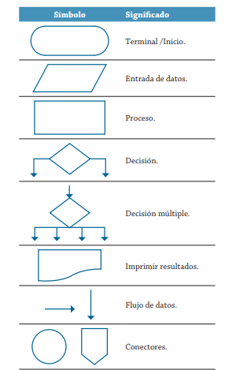

A continuacion tendremos disponibles todos los simbolos a disposicion en la configuracion de algoritmos por medio de un diagrama de flujo.

1. $\rightarrow$ Línea de Flujo
2. ⬭	Terminal (Inicio / Fin)
3. ▭	Proceso / Asignación
4. ▱	Entrada / Salida
5. ♢	Decisión
6. ⏢	Proceso Predefinido / Subrutina
7. 🗄️ / 🛢️	Almacenamiento de Datos (Disco / Base de Datos)
8. ⏥	Conector (Interno / Externo)
   

